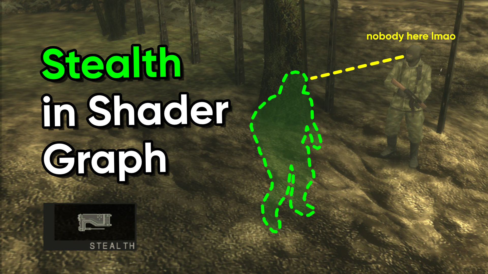

# MGS Stealth Camo in Unity Shader Graph

A repository for a Metal Gear Solid style stealth camo effect.

## Overview

The stealth camo is a special item you can obtain in most main-series Metal Gear Solid games by completing different challenges. This repository contains a shader effect, created using Unity Shader Graph, which looks like the translucent green jelly-like effect you see when wearing the stealth camo in the games.

## Software

This project was created using Unity 2022.3.0f1 (Long-Term Support).

## Tutorials

This project is part of a tutorial which is available in the following places:

- [YouTube](https://www.youtube.com/watch?v=CjgYWtJH1cE)
- [danielilett.com](https://danielilett.com/2024-03-26-tut7-9-mgs-stealth-camo/)

## Authors

This project and the corresponding tutorials were created by Daniel Ilett.

## Release

This project was released on March 26th 2024.
